# Step 1 : Create a workspace

1. Go to the [Microsoft Fabric portal](https://app.fabric.microsoft.com/ "Microsoft Fabric portal") and sign in.

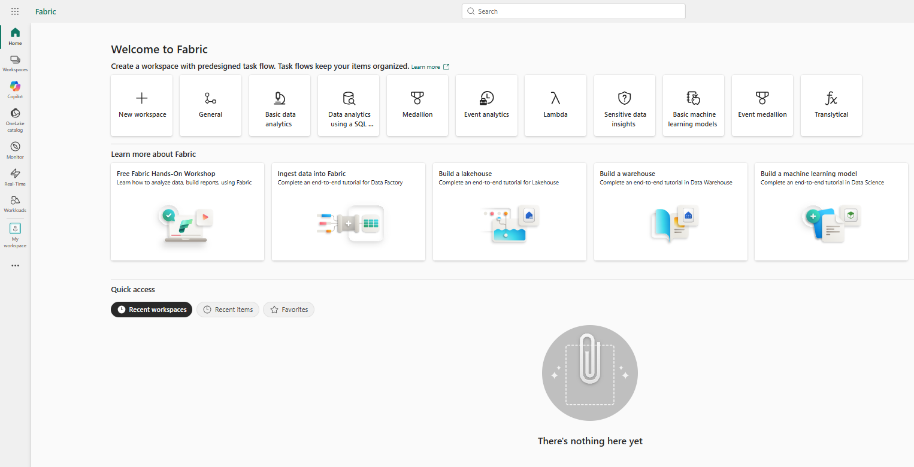

2. Navigate to Workspaces using the left navigation menu and click on + New workspace.

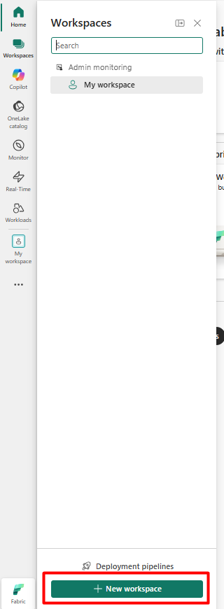

3. Choose a name for the workspace. Insert the name *DemoRealTime*. You can leave the other fields empty. Then expand the Advanced section.

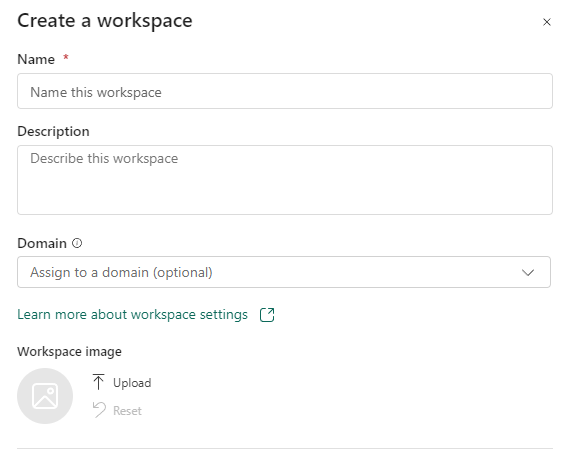

4. Under License mode, choose your Fabric license. You can, for example, use your Fabric trial capacity or a Fabric capacity you've created on Azure. Leave the other settings as default, then click Apply.

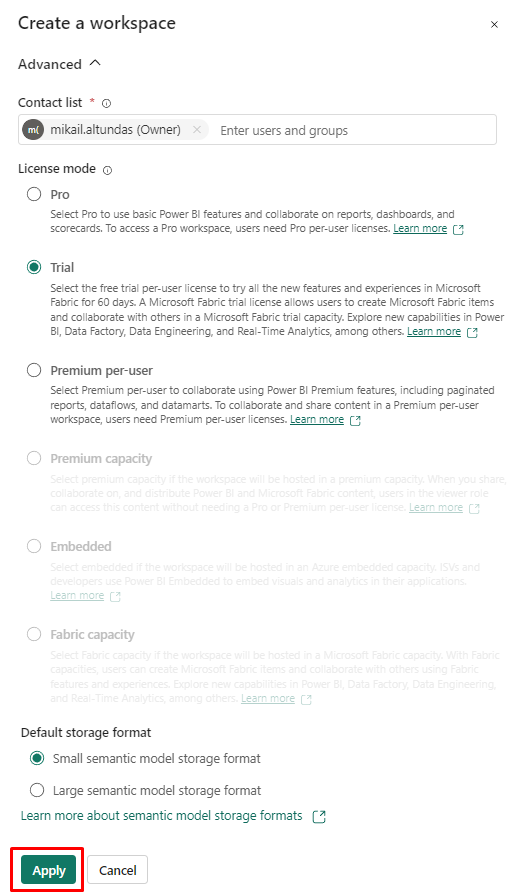

5. The workspace will then be created and automatically displayed on your screen. Check that you have an empty workspace as shown in the image below.

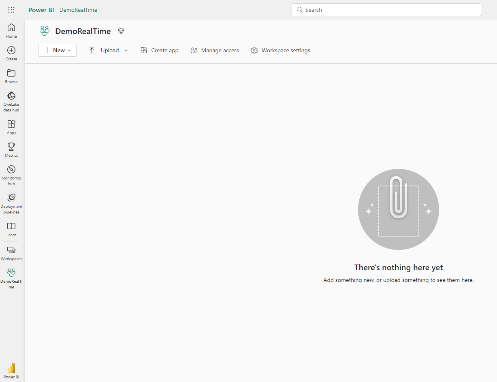

# Step 2 : Create an Eventhouse

In Real-Time Intelligence, you interact with your data inside an Eventhouse. An Eventhouse is a container that can hold one or more KQL databases. A KQL database is a database system suited for ingesting streaming data, which makes it particularly useful for scenarios that require real-time data analysis. Its columnar storage and efficient compression facilitate fast querying over large datasets.

When you create an Eventhouse, Fabric automatically creates a child KQL database with the same name. In this demonstration, we will set up an Eventhouse and use its KQL database to ingest streaming data.

1. In the workspace you've just created, select + New item.

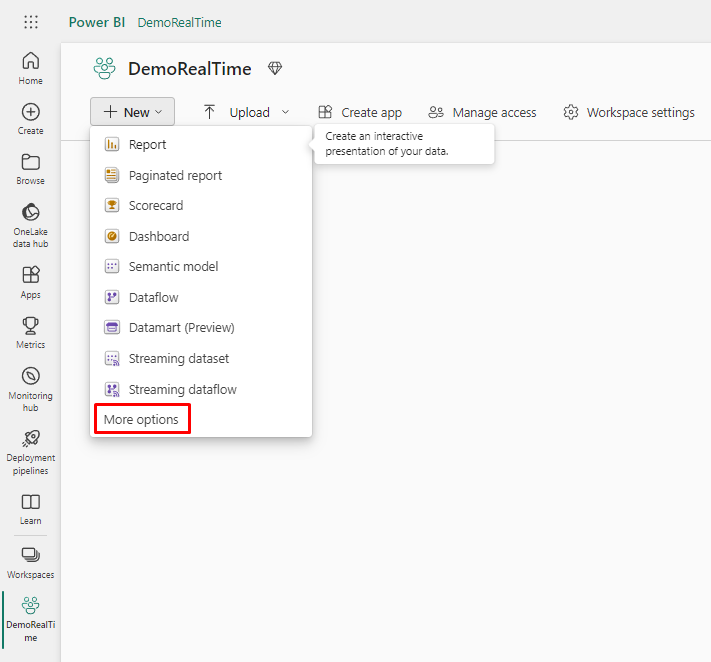

2. In the Filter by item type search box, enter *Eventhouse*, then select the Eventhouse item under the Real-Time Intelligence category.

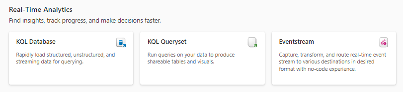

3. Insert the name *NycTaxiDB* for the Eventhouse and click Create. A child KQL database with the same name (*NycTaxiDB*) is created at the same time.

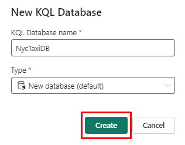

4. When provisioning is complete, the Eventhouse System overview page is shown. In the explorer pane on the left, select the *NycTaxiDB* KQL database. By default, KQL database tables are unavailable in OneLake. You can change this from the database details page by selecting the pencil next to OneLake availability.

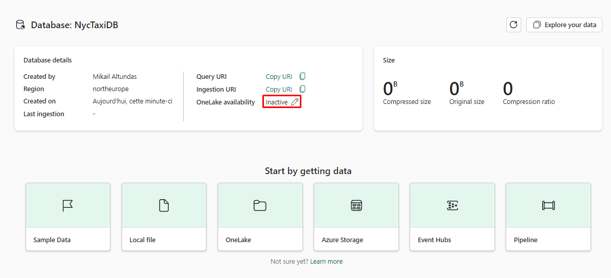

5. Toggle the button to Active and select Done.

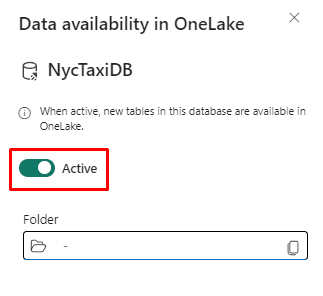

# Step 3 : Create an Eventstream

Eventstream allows you to capture, transform and route real-time events to various destinations with a no-code experience. You can connect to various streaming data sources, such as Azure Event Hubs, Azure IoT Hub or Kafka, and ingest the data into Fabric.

1. Return to the workspace you created earlier by selecting *DemoRealTime* from the left menu.

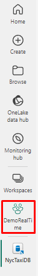

2. The workspace should contain the Eventhouse and KQL database you've just created. In this workspace, you'll find all the elements you'll create for this project. Select + New item.

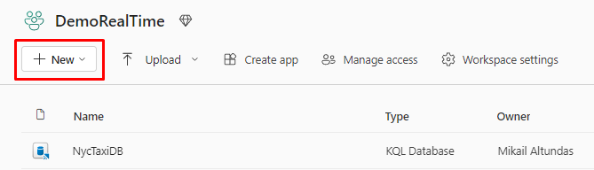

3. In the Filter by item type search box, enter *Eventstream*, then select the Eventstream item.


4. You will be asked to choose a name for the Eventstream. Insert the name *NyTaxiTripsEventstream* and select Create.

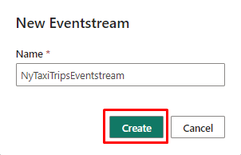

For this demonstration, we're going to use a publicly accessible sample dataset from Microsoft Fabric, featuring New York City taxi trips. This dataset includes a variety of information, such as the date and time of pickup and drop-off, the number of passengers, the distance traveled, and much more.

5. You will be automatically redirected to the Eventstream editor. On the get-started page, select Use sample data. (If you are in an existing, published eventstream, switch to Edit mode and select Add source > Sample data on the ribbon.)

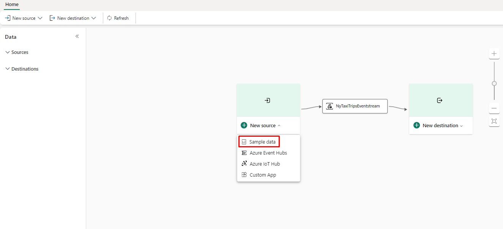

6. Enter *nytaxitripsdatasource* as the Source name, and then select Yellow Taxi from the Sample data options. Then select Add.

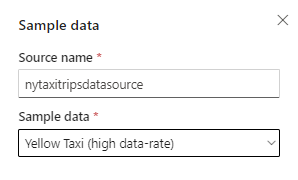

7. With the data source configured, we can now choose the destination. There are several options, such as ingesting data into a Lakehouse or an Eventhouse. For this demonstration, we'll ingest the data into the Eventhouse we created earlier. On the canvas, select the Transform events or add destination card (or Add destination on the ribbon), then select Eventhouse.

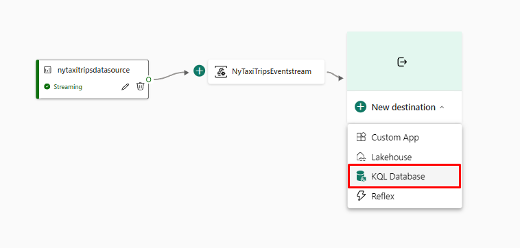

8. In the pane that opens, select the Direct Ingestion mode. For Destination name, enter *nytaxidatabase*. For Workspace, select the workspace we created at the beginning of the tutorial, *DemoRealTime*. For Eventhouse, select *NycTaxiDB*, and for KQL database select *NycTaxiDB*. Make sure the box Activate ingestion after adding the data is checked, then select Save.

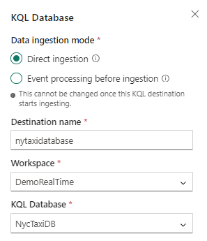

9. The Eventhouse opens on the Get data screen. Select + New table below *NycTaxiDB* and enter the name *nyctaxitrips*. Keep the suggested data connection name and select Next.

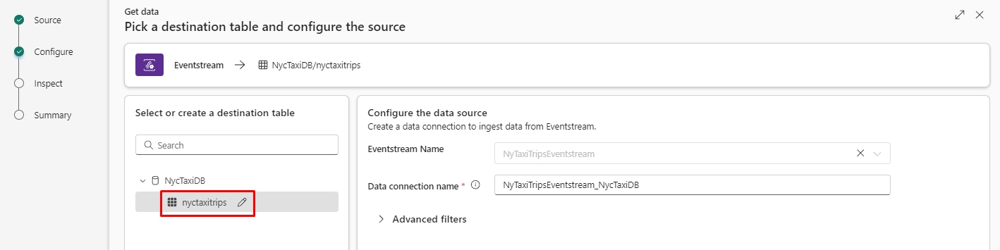

10. On the Inspect the data screen, check that the Format is set to JSON. Then select the Edit columns button to edit the type of the columns.

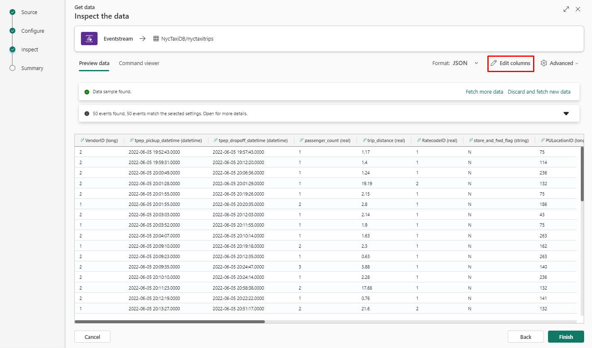

11. On the screen that appears, change the type of the *VendorID* column to int, the *passenger_count* column to long and the *payment_type* column to real. Then select Apply.

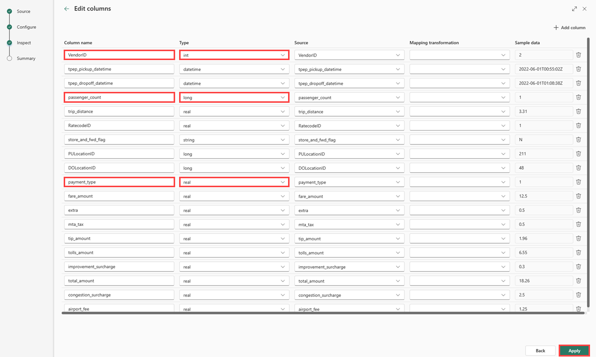

12. Select Finish to finalize the configuration, then close the summary window. Back in the Eventstream editor, select Publish on the ribbon to activate the stream. After a short moment, data begins flowing into the *nyctaxitrips* table.

# Step 4 : Get historical data

In this step, we'll see how to populate our database with flat files. This step is especially useful for loading historical data.

1. Download the [ny-yellow-taxi-location-info.csv](https://raw.githubusercontent.com/microsoft/fabric-samples/main/docs-samples/real-time-intelligence/ny-yellow-taxi-location-info.csv "ny-yellow-taxi-location-info.csv") file. (A copy is also available in the `data` folder of this repository.) The data in this file will be used as a dimension table to indicate the different areas of New York where taxis operate.

2. Return to your *NycTaxiDB* KQL database and select the Get data button on the Database ribbon.

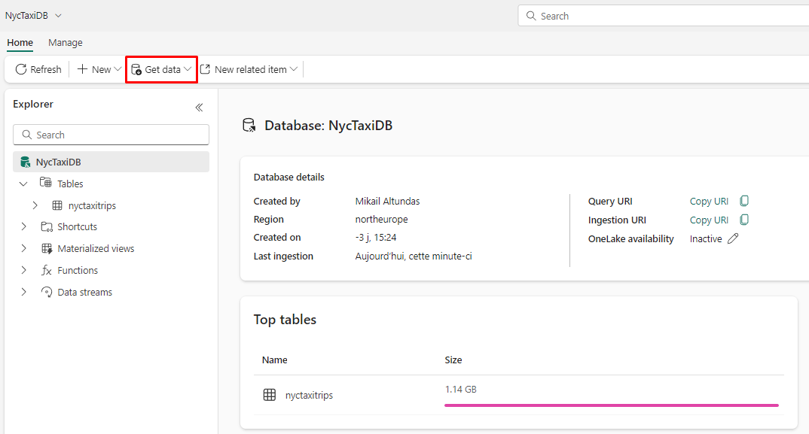

3. In the window that opens, select Local file.

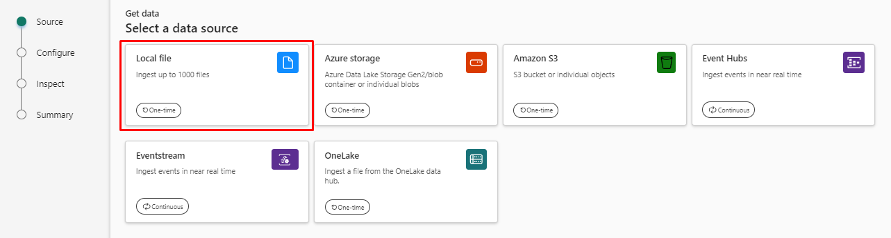

4. Select the New table button and rename it to *Locations*. You'll then be able to load the CSV file you just downloaded. Load the file and select Next.

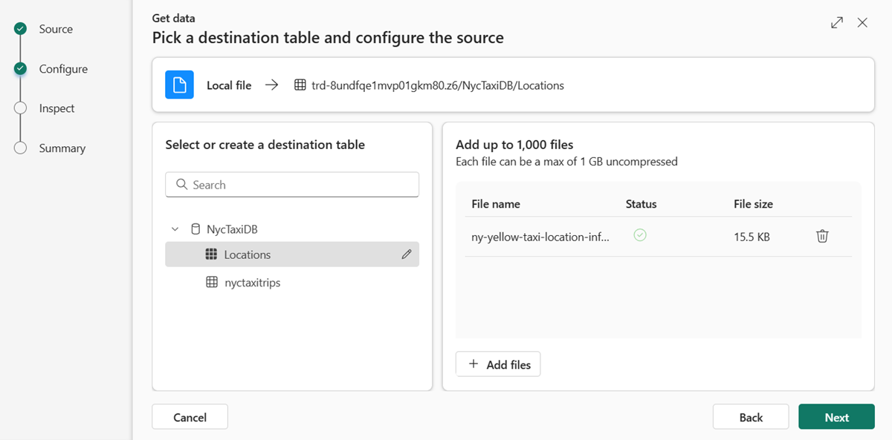

5. A preview of the data will be displayed. We have the option of editing the column type, as we did with the first table we created, but this is not necessary here. Select Finish.

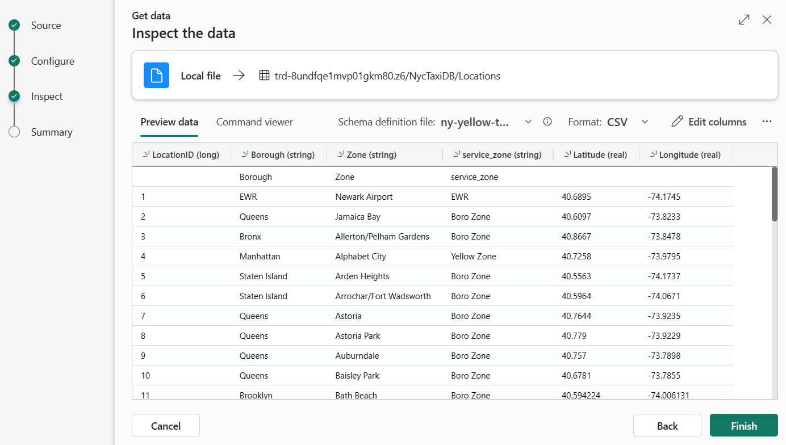

6. You will see a confirmation that the data has been loaded into the table. Select Close when all of the steps have green checkmarks.

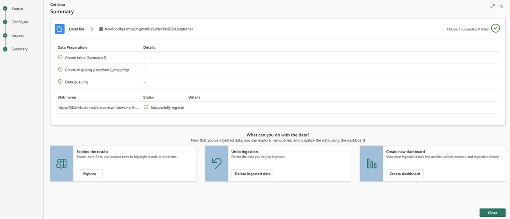

The data from the CSV file has now been loaded into the KQL database.

# Step 5 : Write a KQL query

KQL queries are powerful tools for analyzing large datasets. They are formulated as read-only queries in plain text, using a data flow model that is straightforward to understand, create, and automate.

In this step, we'll write a KQL query to analyze the data and then create a Power BI report based on the results.

1. From the *NycTaxiDB* KQL database, select the New related item button, then select KQL Queryset. (You can also create one from anywhere in the workspace with + New item > KQL Queryset.)

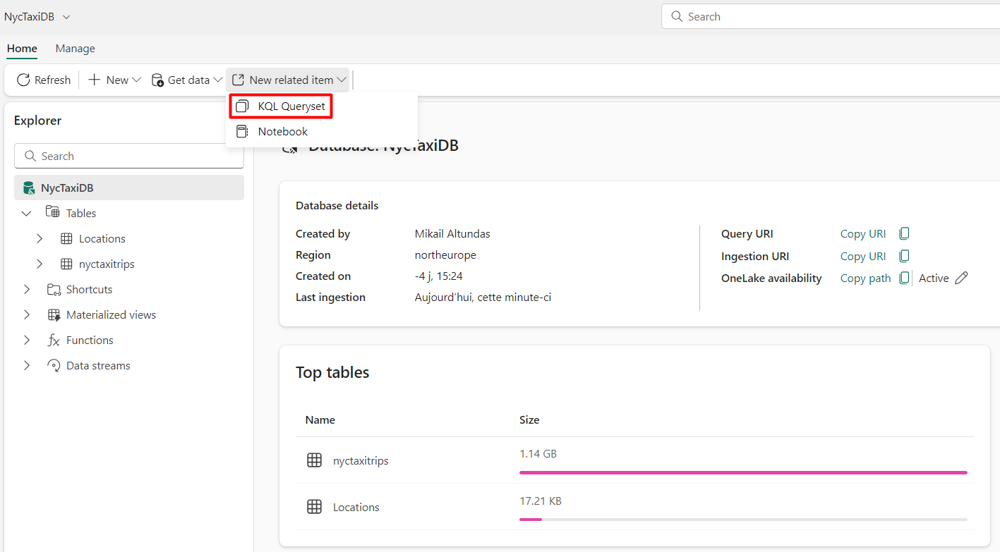

2. Name the query *nyctaxiquery*.

3. Remove the example code in the query and type the query below:

```kusto
nyctaxitrips
| where PULocationID == DOLocationID
| lookup (Locations) on $left.PULocationID==$right.LocationID
| summarize Count=count() by Borough, Zone, Latitude, Longitude
```

The query identifies and counts all taxi trips that start and end in the same location. It then groups these counts by specific geographic details of those places.

You should obtain an output similar to the one in the image below (the values in the table may be different).

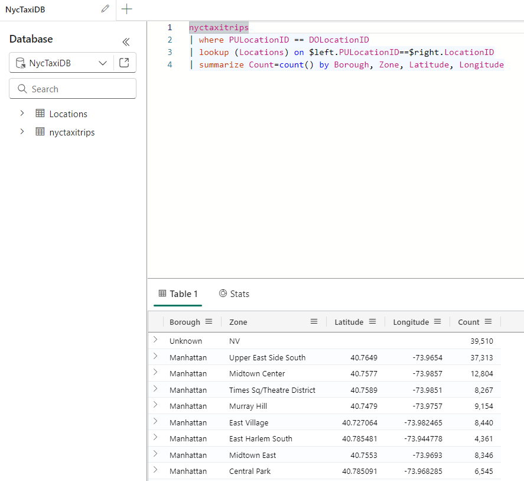

# Step 6 : Build a Power BI report

1. On the same KQL queryset page, with the query selected and run, select Power BI (also labeled Build Power BI report) on the ribbon. A Power BI window will appear so we can build our report on it.

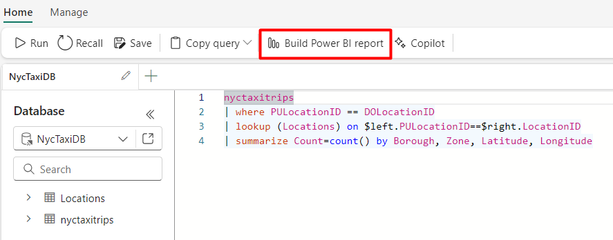

2. In the Visualizations pane, select the Map icon. Drag the *Borough* field into Legend, *Latitude* into Latitude, *Longitude* into Longitude and *Count* into Bubble size.

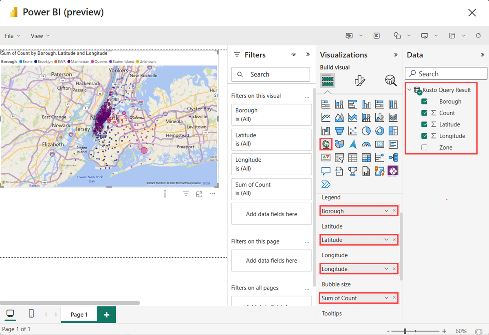

> By default, the Latitude and Longitude fields may be summarized. If this is the case, select the arrow next to the field, then select Don't summarize.

> 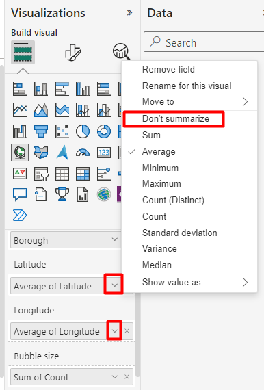

3. Then select the Stacked Bar Chart icon to create a bar chart. Drag the *Borough* field into Y-axis and *Count* into X-axis.

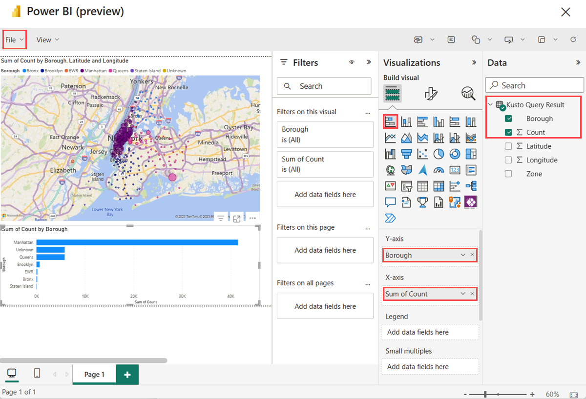

4. Select File, then Save this report. Name the file *nyctaximapsreport* and save it in the workspace created at the beginning of the demonstration, then select Continue.

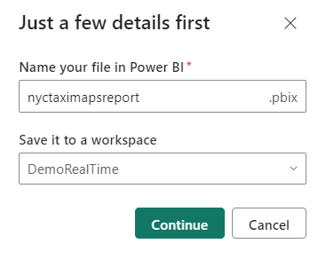

5. A window appears confirming that the report has been saved. Select Open the file in Power BI to view, edit, and get a shareable link.

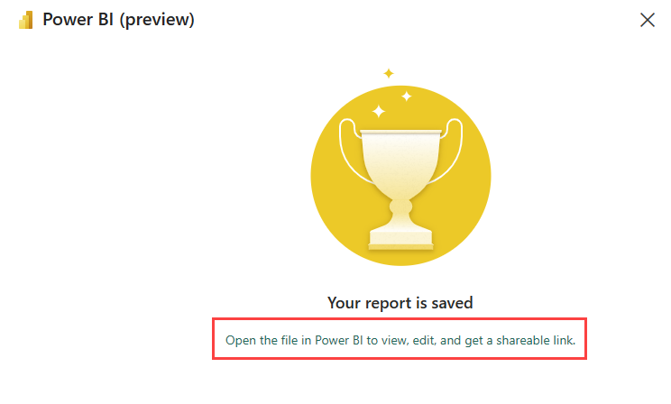

6. In the window that opens, select the Edit button.

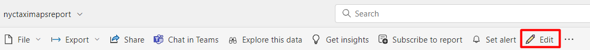

7. In the Visualizations pane, select the paintbrush icon to format the page and expand Page refresh. Then toggle Page refresh to On and set the refresh interval to 10 seconds.

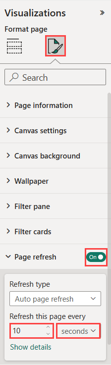

8. On the ribbon, select File, then Save to save your changes.

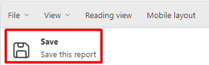

9. You can return to your workspace to view all the elements created during this tutorial.

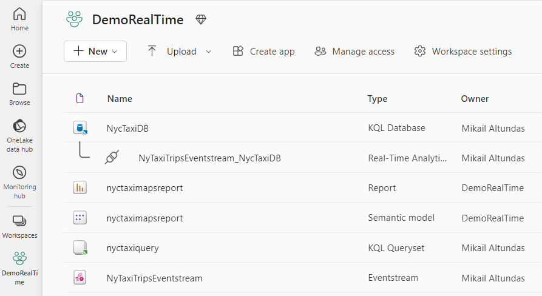

> Tip: For a more native Real-Time Intelligence visualization, you can also build a Real-Time Dashboard directly from the KQL database (New related item > Real-Time Dashboard). Real-Time Dashboards are designed for live KQL data and support auto-refresh out of the box.

This concludes our demonstration. In just ten minutes, we've covered the following key steps:

- Setting up a workspace in Microsoft Fabric
- Creating an Eventhouse and its child KQL database
- Initiating and configuring an Eventstream for real-time data ingestion into the KQL database
- Loading historical data from a flat file
- Crafting KQL queries for data analysis
- Developing and deploying a Power BI report utilizing the data from the KQL database

By following these steps, you're well on your way to effectively managing and analyzing real-time data within Microsoft Fabric.
