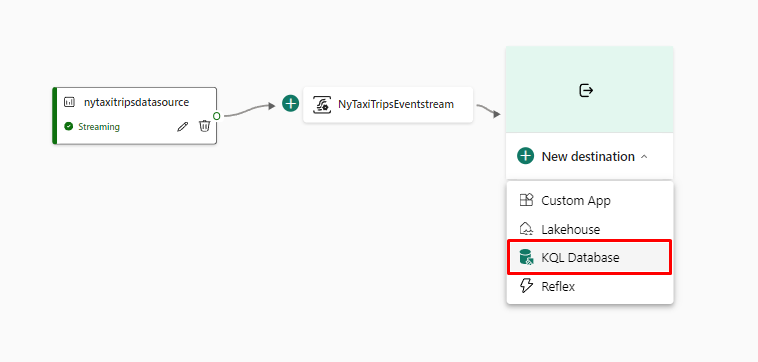

# Step 1 : Create a workspace

1. In the Microsoft Fabric portal, click on the Power BI experience at the bottom left of the window.


2. Navigate to Workspaces using the left navigation menu and click on New workspace.


3. You need to choose a name for the workspace. Insert the name DemoRealTime. You can leave the other cells empty. Then click on Advanced.


4. Then choose your Fabric license. You can, for example, use your trial capacity or a Fabric capacity you've created on Azure. Leave the other settings as default, then click Apply.


5. The workspace will then be created and automatically displayed on your screen. Check that you have an empty workspace as shown in the image below.


# Step 2 : Create a KQL database

A KQL database refers to a database system suited for ingesting streaming data, making it particularly useful for scenarios that require real-time data analysis. Its columnar storage and efficient compression facilitate fast querying over large datasets.

In this demonstration, we will set up a KQL database tailored to ingest streaming data, showcasing its capabilities in real-time data processing

1. In the workspace you've just created, click on the New button and then on More options.


2. Scroll down to the Real-Time Analytics section, and click on the KQL Database button to create a KQL database.


3. Insert the name NycTaxiDB for the database name, leave the type set to New Database (default) and click Create.


4. You'll then land on this page. By default, KQL database tables are unavailable in OneLake. We can change this by clicking on the pencil in the OneLake availability line.


5. Toggle the button to Active and select Done.


# Step 3 : Create an Eventstream

Eventstream allows you to capture, transform and route real-time events to various destinations with a no-code experience. You can connect to various streaming data sources, such as Azure Event Hubs, Azure IoT Hub or Kafka, and ingest the data on Fabric.

1. Return to the workspace you created earlier.


2. The workspace should contain the KQL database you've just created. In this workspace, you'll find all the elements you'll create for this project. Click on the New button, then click on More Options at the bottom of the drop-down menu.


3. Scroll down to the Real-Time Analytics section, then click on Eventstream.


4. You will be asked to choose a name for the Eventstream. Insert the name NyTaxiTripsEventstream.


5. You will be automatically redirected to Eventstream. You will land on the page below. Click on New Source to display the drop-down menu and click on Sample data.


6. Enter nytaxitripsdatasource as the Source Name, and then select Yellow Taxi from the dropdown of Sample data. Then click on Add at the bottom of the window.


7. With the data source configured, we're now ready to configure the destination. Click on New destination, then on KQL Database.



8. On the menu that opens, click on the Direct Ingestion mode. For destination name, enter nytaxidatabase. For the workspace, select the workspace we created at the start of the exercise, DemoRealTime. Next, select the KQL database we created earlier, in this case NycTaxiDB. Finally, click on Add and configure.


9. In the window that opens, click on + New table below NycTaxiDB and enter the name nyctaxitrips. Then click on Next.


10. In the Inspect tab, check that the format is set to JSON. Then click on the Edit columns button to edit the type of the columns.


11. On the menu that appears, change the type of the *VendorID* column to int, the *passenger_count* column to long and the *payment_type* column to real. Then click on Apply.


12. Then, click Finish to finalize the configuration of the Eventstream.

# Step 4 : Get historical data

In this step, we'll see how to populate our database with flat files. This step is especially useful for loading historical data.

1. Download the [ny-yellow-taxi-location-info.csv](https://raw.githubusercontent.com/microsoft/fabric-samples/main/docs-samples/real-time-analytics/ny-yellow-taxi-location-info.csv "ny-yellow-taxi-location-info.csv") file. The data in this file will be used as a dimension table to indicate the different areas of New York where taxis operate.

2. Return to your KQL database and click on the Get Data button.


3. In the window that opens, click Local file.


4. Click the New Table button and rename it to Locations. You'll then be able to load the CSV file you just downloaded. Load the file and click Next.


5. A preview of the data will be displayed. We have the option of editing the column type, as we did with the first table we created, but this is not necessary here. Click Finish.


6. You will see a confirmation that the data has been loaded into the table. Click Close when all three steps have green checkmarks.


# Step 5 : Write a KQL query

KQL queries are powerful tools for analyzing large datasets. They are formulated as read-only queries in plain text, utilizing a data flow model that is straightforward to understand, create, and automate.

In this step, we'll write a KQL query to analyze the output data and create a Power BI dashboard based on the results.

1. Return to the KQL database, click the New related item button, and then click the KQL Queryset button.


2. Name the query *nyctaxiquery*

3. Remove the code examples in the query and type the query below:

```text
nyctaxitrips
| where PULocationID == DOLocationID
| lookup (Locations) on $left.PULocationID==$right.LocationID
| summarize Count=count() by Borough, Zone, Latitude, Longitude
```

The query identifies and counts all taxi trips that start and end in the same location. It then groups these counts by specific geographic details of those places.

You should obtain an output similar to the one in the image below (the values in the table may be different).


# Step 6 : Build a Power BI report

1. On the same KQL queryset page, click on the Build Power BI report button. A Power BI window will appear. We can build our dashboard on it.


2. In the Visualizations tab, click on the Map icon. Drag the Borough field into Legend, Latitude into Latitude, Longitude into Longitude and Count into Bubble size.


> By default, the Location and Longitude fields may be summarized. If this is the case, click on the arrow next to the fields, then click on Don't summarize.

> 

3. Then click on the Stacked Bar Chart icon to create a bar chart. Drag the Borough field into Y-axis and Count into X-axis.


4. Name the file nyctaximapsreport and save it in the workspace created at the beginning of the demonstration, click on Continue.


5. A window appears confirming that the report has been saved. Click Open the file in Power BI to view, edit, and get a shareable link.


6. In the window that opens, click on the Edit button.


7. In the Visualizations pane, select the paintbrush icon to format the page and expand Page refresh. Then, toggle Page refresh to On and set the refresh interval to 10 seconds.


8. On the ribbon, click File, then Save to save changes.


9. You can return to your workspace to view all the elements created during this tutorial.


This concludes our demonstration. In just ten minutes, we've covered the following key steps:

- Setting up a workspace in Microsoft Fabric
- Establishing and configuring a KQL database
- Initiating and configuring an Eventstream for real-time data ingestion into the KQL database
- Crafting KQL queries for data analysis
- Developing and deploying Power BI dashboards utilizing the data from the KQL database

By following these steps, you're well on your way to effectively managing and analyzing real-time data within Microsoft Fabric.
